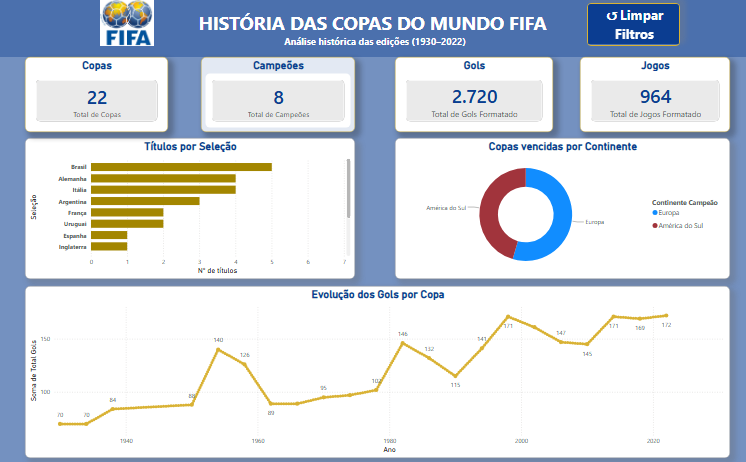

# ⚽ Dashboard Interativo — História das Copas do Mundo FIFA (1930–2022)

  

---

## 📌 Sobre o projeto

Este projeto consiste em um dashboard interativo desenvolvido no Power BI para analisar os dados históricos das Copas do Mundo FIFA realizadas entre 1930 e 2022.

O propósito desse projeto foi apresentar indicadores e visualizações que permitam explorar a evolução da competição ao longo dos anos, 
destacando seleções campeãs, quantidade de gols, jogos realizados e distribuição dos títulos por continente.

___________________________________________________________________________________________________________________________________________________________________

Objetivos:
- Analisar a evolução das Copas do Mundo.
- Identificar as seleções com maior número de títulos.
- Comparar os continentes campeões.
- Visualizar a evolução do número de gols por edição.
- Disponibilizar uma consulta rápida ao histórico das finais.

___________________________________________________________________________________________________________________________________________________________________

Indicadores:
- Total de Copas
- Países Campeões
- Total de Gols
- Total de Jogos

___________________________________________________________________________________________________________________________________________________________________

Visualizações:
- Ranking de títulos por seleção
- Copas vencidas por continente
- Evolução dos gols por edição
- Histórico das finais
- Segmentação por ano
___________________________________________________________________________________________________________________________________________________________________

Ferramentas utilizadas:
- Power BI Desktop
- DAX
- Modelagem de Dados
- Relacionamentos entre tabelas
___________________________________________________________________________________________________________________________________________________________________

Tecnologias:
- Power BI Desktop
- DAX
- Modelagem Dimensional
- Git
- GitHub
___________________________________________________________________________________________________________________________________________________________________

Dataset:
Os dados utilizados neste projeto foram organizados em uma base contendo informações históricas das Copas do Mundo FIFA realizadas entre 1930 e 2022.

********************************************
Desenvolvido por 
Stéphanie Moraes

Em formação em Análise de Dados, desenvolvendo projetos práticos com Power BI, SQL, Python e PySpark.
